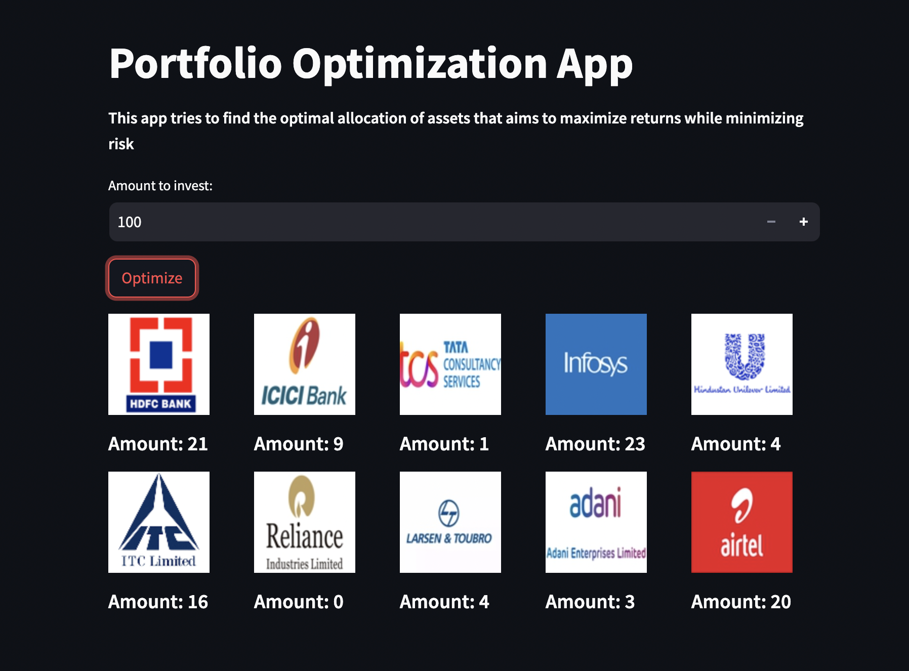
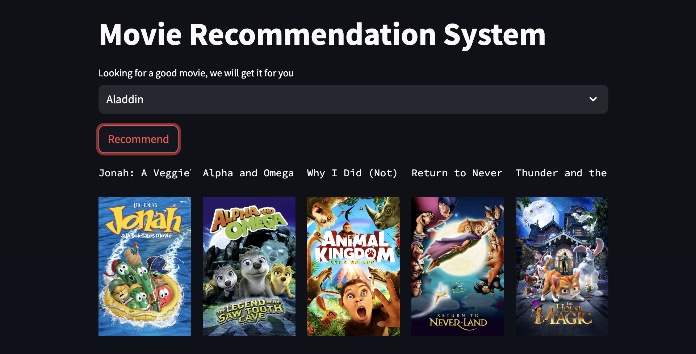

# Data Science and Analytics

&nbsp;

<!-- 
&nbsp;
 -->

## Project 1: [Financial Complaints Analysis](https://github.com/VIDIT-9/Financial-Complaints-Analysis)
Conducted Data Analysis on financial complaints dataset to identify the areas for improvement and aims to improve customer experience.
* Study a dataset containing 6 lakh+ complaints received by various finance companies over 5 Years (from Dec-2011 to Nov-2016).
* Analyzed different attributes and compared last 5 years complaints to last 1 year to evaluate variation in previous years.
* Created an Interactive Dashboard using Tableau to enhance stakeholders' comprehension of the problem.
  
  

  
&nbsp;

## Project 2: [Credit Scorecard Modelling](https://github.com/VIDIT-9/Credit-Scorecard-Modelling)
Build an in-house risk model on behalf of a bank to make lending decisions for subprime mortgages to maximize profitability .
* Performed Chi-Square binning for features and computed Information Value (IV) and Weight of Evidence (WoE).
* Predicted likelihood of loans using Logistic Regression Classifier and calculated Credit Score Metrics using Decile method.

  

  
&nbsp;

## Project 3: [Portfolio Optimization](https://github.com/VIDIT-9/Portfolio-Optimization)
Implemented a algorithm to find the optimal allocation of assets that aims to maximize returns while minimizing risk.
* Gathered real-time data of multiple stocks prices starting from FY'22 using python library to access Yahoo Finance API.
* Calculated Sharpe Ratio which compares the return with risk using Expected Portfolio Returns and Volatility.
* Employed Monte Carlo algorithm as it is suitable for risk assessment, risk management and decision analysis.

  

  
&nbsp;

## Project 4: [Customer Classification in Banking](https://github.com/VIDIT-9/Customer-Behaviour-Classification-in-Banking)
Performed customer classification to subscribe for the term deposit for Targeted Marketing and Improved Conversion Rates.
* Implemented Feature Selection using Extra Tree Classifier and check p-value statistic test for every feature.
* Converted imbalanced dataset (9 : 1) into balanced dataset (1 : 1) by executing oversampling using SMOTE.

  

  
&nbsp;

## Project 5: [Data Analysis on IPL](https://github.com/VIDIT-9/Sparks-foundation-internship)
Conducted Data Analysis on IPL matches to derive actionable insights and trends, contributing to strategic decision-making
* Performed Exploratory Data Analysis on Indian Premier League dataset containing 1.8 lakh records of each delivery.
* Identified out Most Valuable Players and Teams a company should endorse for their products to increase their sales.
* Identified key factors like toss results and fielding potential should be considered as they had impacts on match results
  
  
  
  
  
&nbsp;

## Project 6: [Movies Recommendation System](https://github.com/VIDIT-9/Recommender-System-TMDB-dataset)
Developed content based recommendation system that provides movie suggestions based on user preferences.
* Merged two datasets of 4800 movies and dug out suitable features for our system and performed Data Preprocessing.
* Combined all important features (genres/keywords/actors/directors) into one column and converted them into vectors.
* Model was trained to find top-5 similar movies on the basis of distances between each vectors using Cosine similarity.
  
  

  
